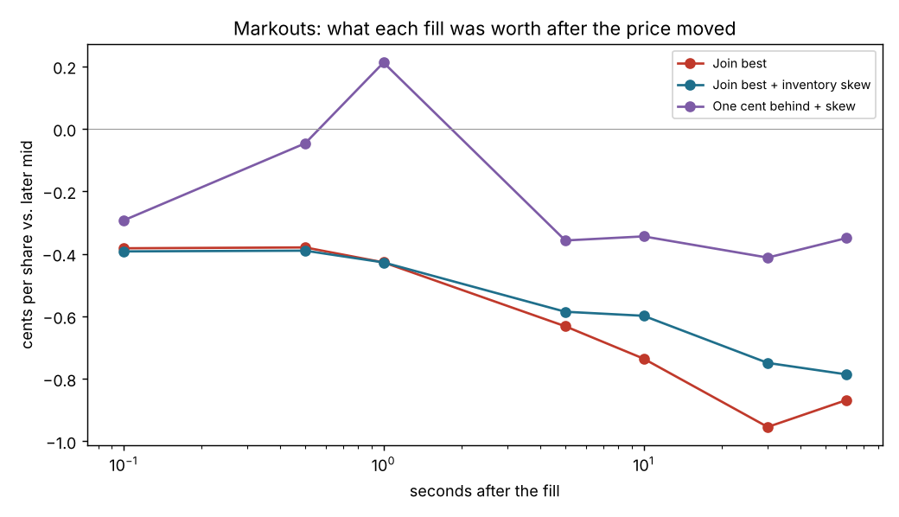
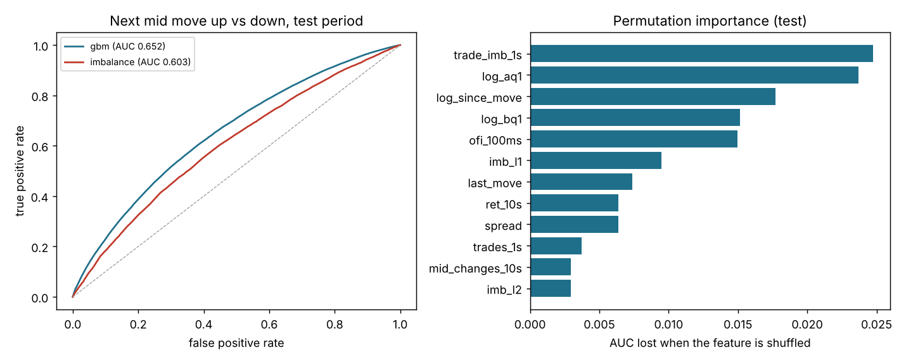
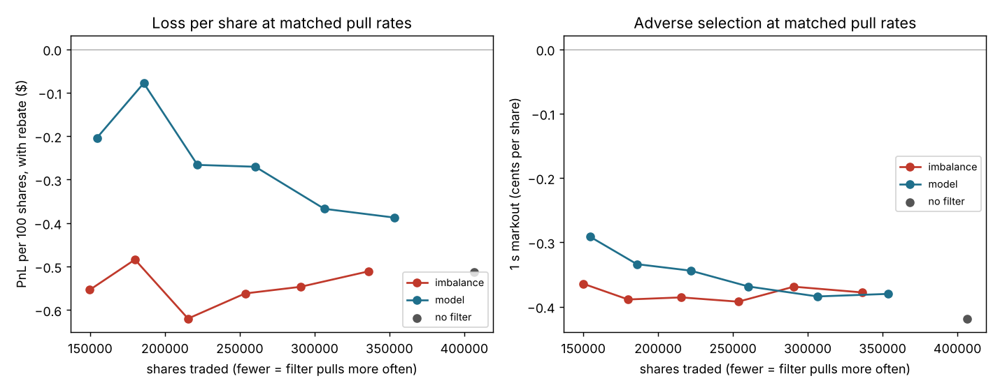
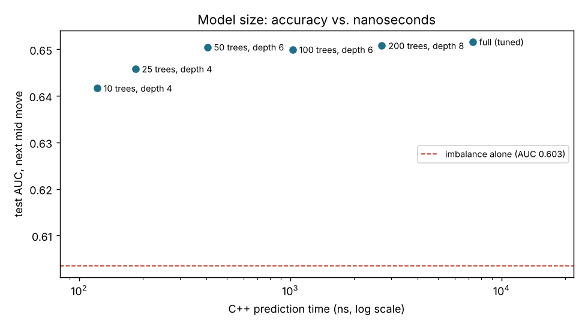
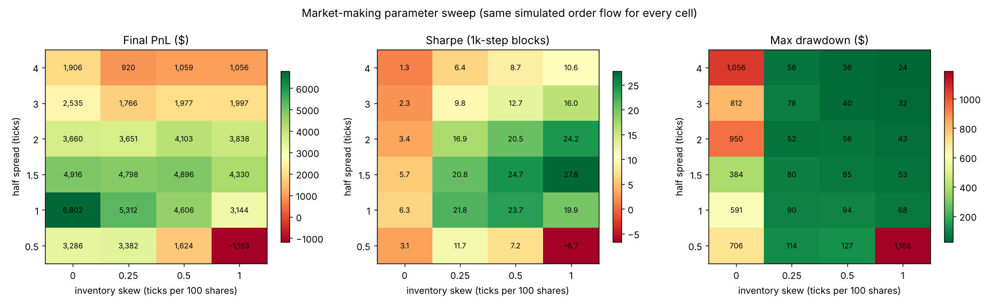

# Market-making backtest on the C++ order book

A market-making strategy, written in Python, trading in a simulated market and then on a full day of real Nasdaq order flow for Apple. Both run on the C++ order book through `obfast`, a CPython extension module.

## Run it
```bash
make -C cpp python                         # build obfast (needs: sudo apt install python3-dev)
python backtest/run_backtest.py            # 24-setting sweep, ~20 s; writes backtest/results/
python backtest/bench_bindings.py          # pure-Python book vs C++ book, same orders
python backtest/real_mm.py ~/itch/AAPL_events.csv   # real-data study (see below for getting the file)
python backtest/ml_signal.py ~/itch/AAPL_events.csv     # ML signal (see below), then ml_backtest.py
python -m unittest discover -s backtest -v # binding + backtest + ML tests
```
Needs `numpy`, `pandas` and `matplotlib` (plus `scikit-learn` for the ML signal).

## The bindings
`cpp/bindings/obfast.cpp` exposes the C++ book to Python through the CPython C API directly, with no pybind11 or other dependency. The order methods use `METH_FASTCALL`, so a call costs little more than the C++ work, and C++ exceptions become Python exceptions (`obfast.OrderBookError` is a `ValueError`).

```python
import obfast
book = obfast.Book()
book.limit(1, obfast.SELL, 100, 10_050)   # -> []
book.limit(2, obfast.BUY, 40, 10_100)     # -> [(2, 1, 10050, 40, 0)]  (buy_id, sell_id, price, qty, aggressor)
book.mid(), book.depth(obfast.SELL), book.remaining(1)
```

Same 300k random orders, driven from a Python loop:

| Book | Orders/s |
|---|---|
| Pure Python (`orderbook.py`) | 0.37 M |
| C++ via `obfast` | **4.77 M (12.9×)** |

Both books produce identical trades. A randomized test checks this on 20k mixed adds, cancels and modifies, and memory stays flat over millions of calls, so no reference counts leak.

## On real data: market making Apple on 2019-01-30 (`real_mm.py`)
The simulation above is stylized. This part runs the strategy against the real thing: every Apple order event Nasdaq reported that day (1.67M events, exported with `itch_replay --track AAPL --events`). The book is rebuilt with the C++ book through `obfast`.

**How fills work.** The market maker's quotes are *shadow orders*: they sit in a virtual queue next to the real orders but don't change what anyone else did. Because ITCH names every order, the backtest knows exactly which real orders are ahead of each quote when it's placed. A quote fills when:
1. the orders ahead of it trade or cancel, and an order behind it then trades at its price (the incoming order would have reached the quote first), or
2. the market trades through its price, or
3. a new order on the other side is priced through it.

Placing and cancelling take effect after a latency. Even at zero latency nothing happens mid-sweep, since one incoming order that takes several levels shows up as several executions with the same timestamp. `test_real_mm.py` tests each rule on hand-written event streams.

| Strategy (100 µs latency, 100-share quotes, 9:35–15:55) | PnL | With rebate* | Shares | Edge at fill | Markout 1 s | Markout 60 s |
|---|---|---|---|---|---|---|
| Join the best bid and ask | −$6,879 | −$4,742 | 1,068,666 | +0.60¢ | −0.43¢ | −0.87¢ |
| Join best + inventory skew | −$6,405 | −$4,597 | 903,776 | +0.60¢ | −0.43¢ | −0.79¢ |
| One cent behind best + skew | −$299 | −$234 | 32,799 | +1.81¢ | +0.21¢ | −0.35¢ |

*Assumes a $0.0020/share rebate for adding liquidity; Nasdaq's actual rate depends on the firm's volume tier.


**What it shows**
- **Adverse selection beats the spread.** Each fill is on average 0.6¢ better than the mid at that moment. Within a tenth of a second the mid has moved about 1¢ against it (markout −0.38¢), and it keeps drifting the wrong way over the next minute. The orders that trade with a resting quote are disproportionately the ones that know where the price is going, so quoting at the best price all day loses money steadily even before inventory risk.
- **Inventory skew halves inventory swings but doesn't fix the problem.** Max inventory falls from ±1,097 to ±507 shares and drawdown shrinks, but the loss per share is about the same, because the losses come from adverse selection, not from holding inventory.
- **Standing one cent back is safer but barely trades** (420 fills), and with so few fills its markouts are noisy.



**Latency is money.** The same skewed strategy, varying only how long a place or cancel takes:

| Latency | 0 | 100 µs | 1 ms | 10 ms | 100 ms |
|---|---|---|---|---|---|
| PnL with rebate | −$2,745 | −$4,597 | −$7,059 | −$8,711 | −$10,892 |
| Edge at fill | +0.87¢ | +0.60¢ | +0.34¢ | +0.22¢ | +0.10¢ |
| Markout 1 s | −0.29¢ | −0.43¢ | −0.55¢ | −0.68¢ | −0.82¢ |

Every step slower makes things worse, because a slow cancel leaves a stale quote out for faster traders to hit. That's why market makers spend so much on speed.


**Trying signals: when *not* to quote.** Two signals were added to the skewed strategy, both re-checked on every book event:
- *Imbalance:* with `imb = (bid size − ask size) / (bid size + ask size)` at the top of the book, pull the bid when `imb < −threshold` and the ask when `imb > threshold`. A thin side tends to be the next one to get eaten.
- *Thin level:* pull a quote when its price level has fewer than N real shares on it.

| Variant (100 µs, with rebate) | PnL | Shares | PnL per 100 shares | Markout 1 s |
|---|---|---|---|---|
| Skew, no signal | −$4,597 | 903,776 | −$0.51 | −0.43¢ |
| + imbalance, threshold 0.2 | −$1,470 | 249,562 | −$0.59 | −0.41¢ |
| + thin level, < 200 shares | −$2,059 | 278,040 | −$0.74 | −0.50¢ |

| Imbalance threshold | 0 (off) | 0.2 | 0.4 | 0.6 | 0.8 |
|---|---|---|---|---|---|
| PnL with rebate | −$4,597 | −$1,470 | −$1,739 | −$2,546 | −$3,083 |
| Shares | 904k | 250k | 342k | 466k | 630k |

Both signals cut the day's loss by 55–70%, but **neither made it profitable, and neither improved the fills**: the loss per share and the markouts stay the same or get worse. The signals help by trading less, not by picking better trades. Pulling harder (a thin-level cutoff of 800 shares) gets the loss to about −$170, but only by barely trading (28k shares).

**Where the losses come from.** Splitting the skewed strategy's fills by how many real shares were ahead of the quote when it was placed (`results/real/queue.csv`):

| Shares ahead at placement | 0 (alone) | 1–100 | 101–300 | 301–600 | 601–1500 | >1500 |
|---|---|---|---|---|---|---|
| Shares filled | 155k | 225k | 228k | 109k | 175k | 13k |
| Markout 0.1 s | −0.73¢ | −0.33¢ | −0.34¢ | −0.35¢ | −0.25¢ | −0.57¢ |
| Median wait to fill | 1 ms | 0.37 s | 0.57 s | 0.72 s | 0.80 s | 0.85 s |

The worst fills, at twice the loss of the others, are quotes that landed *alone*: they arrived after their level had already emptied and were filled within a millisecond by the same move that cleared it. That's latency again. The quote is stale on arrival. Fixing it needs either a faster reaction (see the latency table) or a short-horizon price prediction good enough to stay out of the way, which top-of-book signals alone don't give.

**Limitations**
- Shadow orders have no market impact. In reality the market maker's 100 shares would have taken some fills from other orders and could have changed what others did, so fill counts are on the high side.
- One stock, one day. The rebate is an assumption. Inventory left at 15:55 is marked at the closing auction price.
- Fills at the open and close auctions and hidden-order executions aren't modeled.

```bash
./cpp/build/itch_replay ~/itch/01302019.NASDAQ_ITCH50.gz --symbols AAPL --track AAPL --events --out ~/itch
python backtest/real_mm.py ~/itch/AAPL_events.csv     # ~1 min; writes backtest/results/real/
```

## An ML signal: predicting the next move from order flow

The study above ends on an open problem: quotes get picked off because they're stale, and top-of-book imbalance alone doesn't predict the move well enough to avoid it. This section builds models that do, grades them as predictions (AUC against the imbalance baseline), then in dollars in the backtest, then away from the afternoon they were tested on, and finally runs them in C++.

```bash
python backtest/ml_signal.py    ~/itch/AAPL_events.csv   # features, labels, models, AUC (~15 min); writes results/ml/
python backtest/ml_backtest.py  ~/itch/AAPL_events.csv   # toxicity models + 180 tuning-hour and 278 test backtests (~13 min)
python backtest/ml_spy.py       ~/itch/AAPL_events.csv ~/itch/SPY_events.csv        # SPY lead-lag features
python backtest/ml_generalize.py stocks ~/itch/{MSFT,INTC,AMZN,NVDA,SPY}_events.csv  # other stocks
python backtest/ml_generalize.py day2 ~/itch/d2/AAPL_events.csv                      # a second, untouched day
make -C cpp ml && python backtest/export_model.py && python backtest/export_model.py --check ~/itch/AAPL_events.csv
python backtest/model_size_tradeoff.py ~/itch/AAPL_events.csv                        # accuracy vs nanoseconds
```
Also needs `scikit-learn`. `ml_backtest.py` writes `docs/playground_data.json` for the **[interactive playground](https://adamdn-code.github.io/orderbook/playground.html)**. Other stocks' event files come from `itch_replay FILE --symbols SYM --track SYM --events`. The second day is Nasdaq's public sample file for 2019-12-30.

### Setup
- *Samples:* one per timestamp after all its events are applied (1.44M for AAPL), so features never see half of a sweep.
- *Labels:* is the next mid-price change up or down? Also: up or down 100 ms and 1 s later, and the *latency-aware* labels described below.
- *Features (19, all causal):*
  - spread; depth imbalance at 1, 2 and 5 levels; log sizes at the touch; microprice offset
  - order-flow imbalance (Cont, Kukanov & Stoikov) over 100 ms, 1 s and 10 s
  - signed trade volume and trade counts over 1 s and 10 s
  - mid change over 1 s and 10 s; time since the last move and its direction
  - No time-of-day feature, which would just memorise the morning.
- *Split:* train 9:35–12:30, tune 12:30–13:30, test 13:30–15:55, with a 60 s embargo at each boundary, never shuffled. Settings for the gradient-boosted trees (scikit-learn `HistGradientBoostingClassifier`) are picked on the tuning hour, then the model is refit on train + tune and scored on test once.
- *Intervals:* block bootstrap over 1-minute blocks. Consecutive samples share a label, so a row-level bootstrap would be far too narrow.
- *Tests* (`test_ml.py`, 11):
  - features at time *t* are identical whether the events after *t* are kept, dropped or replaced
  - each label is checked on hand-written events
  - the C++ features and probabilities match Python bit for bit

### How well it predicts (AAPL, test period 13:30–15:55, includes the 2 pm Fed announcement)

| Label | Imbalance (baseline) | Logistic, all features | Gradient boosting | Gain over baseline, 95% CI |
|---|---|---|---|---|
| Next mid move (528,778 samples) | 0.603 | 0.609 | **0.652** | +0.048 (+0.041 to +0.054) |
| Up/down in 100 ms | 0.638 | 0.642 | **0.683** | +0.045 (+0.034 to +0.052) |
| Up/down in 1 s | 0.582 | 0.592 | **0.605** | +0.023 (+0.009 to +0.035) |

- The model beats the baseline in every half hour of the test period.
- It is calibrated: the top decile predicts 72% up, and 73% were.
- Logistic regression barely beats imbalance, so the gain comes from interactions the trees find, not just from adding features.
- Most important features: signed trade flow over the last second, the sizes at the best ask and bid, time since the last move, and 100 ms order-flow imbalance.



### Training for the latency you have
A quote you pull at time *t* is only gone at *t* + latency, so a move inside that gap can't be dodged. A latency-aware label asks for the direction of the first mid change *after* the cancel could land. Trained on those labels, the model beats the zero-latency model where the gap is long enough to matter:

| Latency | Imbalance | Zero-latency model | Latency-trained model | Gain |
|---|---|---|---|---|
| 100 µs | 0.588 | 0.635 | 0.633 | −0.001 |
| 1 ms | 0.570 | 0.594 | **0.602** | +0.008 |
| 10 ms | 0.549 | 0.572 | **0.581** | +0.010 |

### Training on the market maker's own fills
The direction model answers "which way is the next move?". The question that costs money is narrower: "if my bid gets hit now, what is that fill worth a second later?" `ml_toxicity.py` learns that directly.
- *Data:* the plain market maker's fills from the morning, with features taken at the last moment a cancel could still have beaten each fill.
- *Features:* the 19 features turned to the fill's point of view (for ask fills every directional feature is negated and the bid/ask sizes swap), so one model serves both sides.
- *Results:* with only about 5,500 training fills it ranks losing fills better than imbalance on the test afternoon (AUC 0.554 vs 0.506 at zero latency). The fills it rates worst lost 0.53¢/share; the ones it rates best made 0.05¢.

### Does it make money?
Each model becomes a quote filter. When triggered, it either pulls the threatened quote or steps it back a cent.

Pulling more always means trading less, which earlier looked like an improvement and wasn't. So each filter's thresholds are set so it is active the same share of the time (10–60%) on the tuning hour, and the comparison is **loss per share at matched activity**:
- The next-move model loses less per share than imbalance in **all 48** matched settings (6 rates × 4 latencies × pull or step back).
- The latency-trained model wins **34/36**, and the toxicity model **44/48**.

**Picking the rate without peeking.** For the headline numbers, each filter's activity rate was picked as the most profitable on the tuning hour, using models fit on the morning only, and then the test afternoon was run once. (An earlier version of this README quoted +$160 at zero latency. That was the best test-period rate, picked after looking. The honest number is below.) Test afternoon, join best + inventory skew, PnL with rebate:

| Latency | No filter | Imbalance (best of pull/step) | Best ML filter, tuning-hour pick |
|---|---|---|---|
| 0 | −$1,147 | −$841 (pull, 50%) | **−$274** (toxicity, step back, 30%) · next move, pull, 20%: −$470 |
| 100 µs | −$2,086 | −$1,226 (step, 40%) | **−$835** (latency-trained, pull, 30%) |
| 1 ms | −$2,792 | −$2,113 (step, 20%) | **−$1,041** (latency-trained, step back, 60%) |
| 10 ms | −$3,325 | −$2,475 (step, 10%) | **−$1,303** (latency-trained, pull, 60%) |

- Nothing makes money after honest selection, but every ML filter loses much less than quoting blindly or filtering on imbalance.
- The best ML filter cuts the loss by 60–76% against no filter and 32–67% against imbalance.
- The latency-trained model matters most when you're slow. At 10 ms it loses −$1,303 against −$2,270 for the zero-latency model.
- Pull vs. step back has no consistent winner.
- Quoting 1¢ behind trades too little for conclusions; it's in the playground only.



### Away from this afternoon
**Other stocks, same day** (each stock's own 13:30–15:55 test period, AUC for the next move):

| Stock | Mean spread | Imbalance | AAPL model, unchanged | Own model, same protocol | Own − imbalance, 95% CI |
|---|---|---|---|---|---|
| MSFT | 1.2¢ | 0.699 | 0.684 | **0.734** | +0.030 to +0.039 |
| INTC | 1.1¢ | 0.676 | 0.590 | **0.710** | +0.026 to +0.041 |
| SPY | 1.3¢ | 0.688 | 0.667 | **0.700** | +0.010 to +0.016 |
| NVDA | 4.6¢ | 0.599 | 0.622 | **0.639** | +0.032 to +0.048 |
| AMZN | 52.7¢ | 0.535 | 0.554 | **0.595** | +0.043 to +0.078 |

- The method generalizes: a model trained the same way beats imbalance on every stock.
- The fitted AAPL model does not transfer. It's *worse* than imbalance on the one-tick stocks (MSFT, INTC, SPY), where queue sizes behave very differently, and better only on the wider-spread names.
- Order-flow models are per-instrument, or at least per tick regime.

**A second day** (2019-12-30, with every model, threshold and rate frozen from 2019-01-30): `ml_generalize.py day2` is ready but hasn't been run yet; the results will be added here.

**SPY as a leading signal:** adding nine SPY features to AAPL's model (SPY returns, order flow and depth imbalance as of each AAPL snapshot, plus how far SPY has moved since AAPL last moved) did **not** help: 0.651 vs 0.652 for the next move (difference −0.004 to +0.002), and 0.679 vs 0.683 at 100 ms. The most useful SPY feature was the catch-up one, but its importance was a sixth of AAPL's own top features. At these horizons AAPL's own book already holds what SPY knows.

### In C++, next to the matching engine
`cpp/ml/` computes the 19 features incrementally (O(1) per update, with forward-only window pointers) and evaluates the exported trees, branch-free and 8 trees at a time. `export_model.py --check` replays the whole AAPL day through it:
- Features are **bit-identical** to Python's on all 1,441,976 decisions, and probabilities are identical. Python uses the C math library for its two `log` features so this holds exactly.
- Updating the features costs **~200–270 ns per decision** on top of the book.
- The tuned model (300 trees, depth up to 25) costs **~7 µs** per prediction. Smaller models trained the same way:

| Model | Test AUC | ns / prediction (C++) |
|---|---|---|
| tuned, 300 trees (leaf-wise, depth ≤ 25) | 0.652 | 7,300 |
| 200 trees, depth 8 | 0.651 | 2,700 |
| **50 trees, depth 6** | **0.650** | **405** |
| 25 trees, depth 4 | 0.646 | 185 |
| 10 trees, depth 4 | 0.642 | 122 |
| imbalance alone | 0.603 | – |

50 depth-6 trees keep all but 0.001 of the AUC at 1/18th of the cost. Features plus model then add about 0.6–0.7 µs per decision, which is small next to the 100 µs latency tier and comparable to the engine's own 0.3 µs round trip.



### Limitations
- The backtests are one stock's afternoon. The second day and the other stocks test predictions more broadly.
- The tuning hour is short, so the activity rate it picks is noisy. That's the cost of not peeking.
- The toxicity model has only a few thousand training fills.
- Shadow orders have no market impact, the rebate is assumed, and auction and hidden fills aren't modelled.

## The market (`sim.py`)
- A hidden **fundamental** price follows a random walk with occasional **news jumps**.
- **Liquidity traders** place limit orders a few ticks from the fundamental. Each one rests for a random lifetime, then cancels.
- **Informed traders** send market orders that lean toward the fundamental: when the book's mid is below it, buys are more likely. They're the reason market making is hard, because the orders that hit your quotes are disproportionately the ones that know where price is going.
- Every strategy sees the same random draws, so differences between settings come from the strategy, not luck.

## The strategy
Every step the market maker cancels its quotes and re-quotes around the mid of everyone else's orders:

```
bid = mid - half_spread - skew * inventory / 100
ask = mid + half_spread - skew * inventory / 100
```

- **Half spread**: wider earns more per trade but trades less.
- **Inventory skew**: when long, shift both quotes down, so selling becomes more likely and buying less. This pulls inventory back toward zero.
- Hard cap of ±2,000 shares.

## Results (50k steps, 24 settings)



| Setting | PnL | Sharpe* | Max drawdown | Fills |
|---|---|---|---|---|
| Best PnL, no skew (half spread 1) | $6,802 | 6.3 | $591 | 8,831 |
| Best Sharpe (half spread 1.5, skew 1) | $4,330 | **27.8** | **$53** | 6,234 |
| Too tight + too much skew (0.5, skew 1) | −$1,183 | −6.7 | $1,188 | 15,832 |

Over 5 different seeds: no skew made $5,918 ± $1,023 with ~$612 drawdowns. Half spread 1.5 with skew 1 made **$4,278 ± $67** with ~$87 drawdowns.

**What it shows**
- **Inventory risk is the main risk.** Without skew, inventory swings between the ±2,000 limits (middle panel), and PnL rides the price. Skew keeps it near zero. That gives up about 35% of the profit, but drawdowns shrink 7–11×, risk-adjusted return rises about 4×, and results become far more predictable across seeds (±$67 vs ±$1,023).
- **There's a best spread.** Too tight (0.5) and the spread doesn't cover losses to informed traders. Too wide (3–4) and the strategy rarely trades. 1–2 ticks is best here.
- **Skew and spread interact.** With a 0.5-tick spread, a 1-tick skew pushes one quote across the mid, so the strategy keeps paying the spread to dump inventory and loses money.

*Sharpe here is the mean over the standard deviation of PnL across 1,000-step blocks, scaled by √(number of blocks). It's for comparing settings within this simulation, not an annualized number comparable to real strategies.

## Caveats
This is a stylized market: one venue, no fees or rebates, no latency (the strategy re-quotes every step for free), and background traders who don't react to the strategy beyond what the book does. The numbers show how the trade-offs work; they aren't an estimate of real-world profit.

`sweep.csv` also has each setting's average edge at fill (distance from mid when trading) and 100-step markout (where mid went afterwards), for digging into where the PnL comes from.
